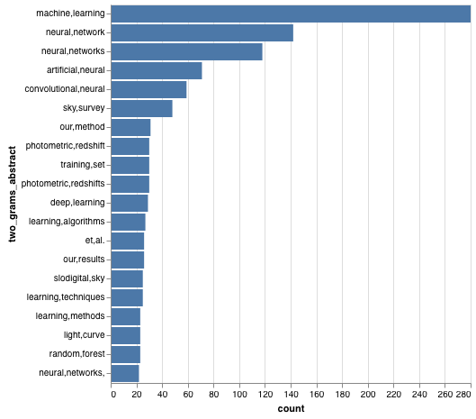

# astro-ph-ml-topics

Using arxiv API to analysis neural network paper in astro-ph 

- Simple N-grams analysis on abstract
- Try to find the common topics in astro that used neural network.
- Basic scraping function is adapted from TIMHEAD, http://betatim.github.io/posts/analysing-the-arxiv/, with some modifications.

## Basic Information

- Number of total astro-ph papers from arxiv API 2010 - 2018: **234975**
- The ratio of neural net or machine learning papers in astro-ph: **0.00258**
- How many of them are about galaxy: **0.224**

## The Growing Trend of Neural Net and Machine Learning Papers in Astro-ph

## Most Mentioned Categories in Astro-ph (limited to neural net and machine learning related papers)

## N-Grams in Astro-ph (limited to neural net and machine learning related papers)

- 1 grams

- 2 grams

- 3 grams

## Topic Modeling on Astro-ph's Abstracts 

A naive with maximum 15 topics, 

- Topic 0 : stars, star, mass, stellar, planet, planets, neutron, binary, systems, evolution, massive, planetary, solar, masses, type
- Topic 1 : radio, sources, 10, source, sim, emission, observations, flux, events, sn, detected, galactic, supernova, detection, times
- Topic 2 : ray, black, hole, jet, emission, kev, agn, accretion, luminosity, pulsar, holes, source, variability, spectral, flux
- Topic 3 : matter, dark, cosmological, energy, universe, gravitational, model, gravity, scalar, equation, lensing, models, lambda, theory, density
- Topic 4 : solar, results, non, time, neutrino, method, signal, effects, order, simulations, using, different, new, noise, study
- Topic 5 : data, model, models, parameters, spectrum, power, parameter, using, analysis, measurements, scale, temperature, constraints, cmb, observations
- Topic 6 : gas, disk, dust, formation, star, molecular, regions, region, cloud, disks, polarization, emission, structure, observations, interstellar
- Topic 7 : line, emission, lines, spectra, alpha, absorption, fe, high, abundance, clouds, abundances, ii, observed, hi, cm
- Topic 8 : galaxies, galaxy, cluster, clusters, formation, star, mass, redshift, stellar, luminosity, sample, population, evolution, ngc, 10
- Topic 9 : energy, gamma, ray, particles, shock, high, thermal, cosmic, rays, emission, plasma, radiation, particle, electron, model
- Topic 10 : field, magnetic, fields, rm, scale, pm, inflation, large, flux, non, small, structure, strong, scales, evolution
- Topic 11 : velocity, accretion, al, et, disc, radial, rotation, km, rate, flow, wind, rates, velocities, core, angular
- Topic 12 : data, survey, optical, light, infrared, telescope, band, sample, using, present, observations, new, photometric, objects, imaging
- Topic 13 : mass, density, distribution, halo, function, simulations, surface, size, model, body, profile, correlation, profiles, radius, observed
- Topic 14 : period, dwarf, phase, spin, mode, orbital, mu, white, dwarfs, frequency, time, short, modes, amplitude, long
